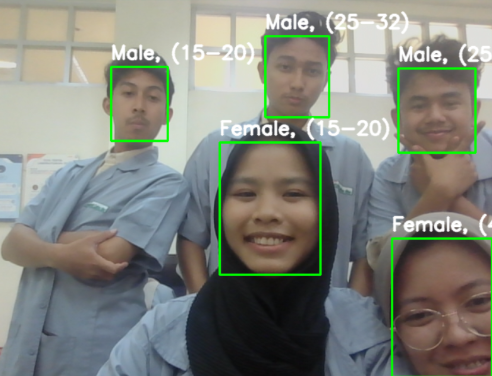

# 👤 Face, Age, and Gender Detection Using OpenCV and Pretrained DNN

## 📖 Background

In today's digital era, technology plays an increasingly vital role across various sectors, including facial recognition. One compelling development is the ability of computer systems to identify a person's face and automatically estimate their **age** and **gender**.  
This technology is widely adopted in fields such as **marketing**, **security**, and **public services**.

Manual classification of faces to determine age or gender is inefficient and prone to human error. Moreover, **real-time demographic data** can provide valuable insights for data-driven decision-making.

Using **OpenCV** along with **pretrained deep learning models**, we can build a face detection system that not only identifies faces but also predicts the age and gender in real time, even using local resources. The system operates efficiently and delivers results with reasonable accuracy.

---

## 🎯 Objectives

- Detect human faces from static images or webcam streams.
- Predict gender (**Male/Female**) from detected faces.
- Predict **age range** (e.g., `0–2`, `4–6`, `8–12`, ..., `60–100`) for each face.
- Display predictions directly on the image/video feed with **bounding boxes and labels**.
- Provide a lightweight, **easy-to-use interface**.

---

## 📁 Pretrained Model

**Source**: [GitHub - smahesh29/Gender-and-Age-Detection](https://github.com/smahesh29/Gender-and-Age-Detection)

Models used:

- 🔍 **Face Detector**  
  - `opencv_face_detector_uint8.pb`  
  - `opencv_face_detector.pbtxt`

- 🧒 **Age Prediction Model**  
  - `age_net.caffemodel`  
  - `age_deploy.prototxt`

- 👩 **Gender Prediction Model**  
  - `gender_net.caffemodel`  
  - `gender_deploy.prototxt`

---

## 🛠️ Tools & Technologies

| Component           | Description                              |
|---------------------|----------------------------------------- |
| 🐍 Python            | Programming language                   |
| 🧠 OpenCV (cv2)      | For computer vision & image processing |
| 🖼️ Pillow (PIL)	Untuk memproses dan menampilkan gambar di GUI |
| 🪟 Tkinter	Untuk membuat antarmuka grafis (GUI)              |
| 📐 math	Untuk perhitungan posisi dan dimensi                  |

---

## ✨ System Features

### ✅ Face Detection
- Detects faces using OpenCV DNN module.
- Works in real-time on webcam or static image.

### ✅ Age & Gender Prediction
- Predicts **gender** as *Male* or *Female*.
- Predicts **age** from 8 predefined categories.
- Displays result directly on bounding box:  
  > `Male, 25-32` or `Female, 8-12`

### ✅ Visualization
- Faces enclosed in rectangles (bounding boxes).
- Labels shown above each face.
- Works with live webcam feed or images.

---

## 🔄 Project Workflow

1. **Face Detection**  
   Detect faces using OpenCV's DNN module.

2. **Preprocessing**  
   Crop and resize face to match model input size.

3. **Gender Prediction**  
   Classify face as *Male* or *Female*.

4. **Age Prediction**  
   Predict age from 8 predefined ranges.

5. **Result Visualization**  
   Display bounding box and label over the face.

---

## 🖼️ Example Output

  

Example Labels:
Female, 15-20
Male, 38-43

---

## 📚 Libraries Used
- cv2 → Untuk akses webcam, deteksi wajah, menggambar kotak, dan visualisasi.
- Pillow (PIL) → Untuk mengolah gambar dan menampilkannya di antarmuka GUI.
- tkinter → Untuk membuat antarmuka grafis aplikasi (GUI) berbasis desktop.

---
